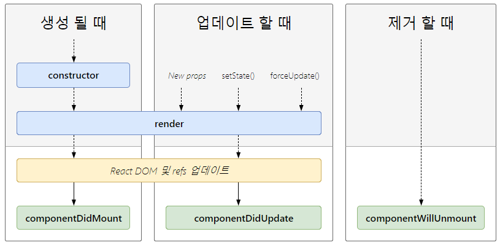
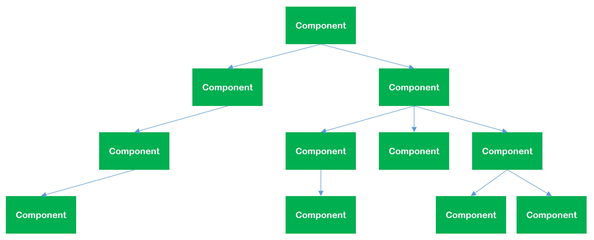

# React Component & Lifecycle


## 개요
최근 프론트 엔드 개발환경과 기술들이 정신없이 변화하고 있습니다. 이러한 기술들을 유행에 따라 매번 습득하지만 다음으로 핫한 기술이 나오면 무용지물이 되기도 합니다. 결국 지식을 쌓는것이 아니라 옛시절에 유행하던 노래와 같이 마음속 깊이 자리잡기만 합니다. 이 글에서는 벌써 유행한지 꽤 시간이 흐른 React의 Component와 Lifecycle 에 대한 짧은 글입니다.

## 현시대에 가장 적절한 라이브러리
지구촌시대, 디지털시대라는 단어를 들었던게 90년도 후반이였던 것 같습니다. 지속적인 발전을 거슬러 어느새 인터넷이 보편화되고, 초등학생들도 스마트폰을 가지고 다니는 시대입니다. 놀이터에서 놀던 아이들이 없어지고, 온라인 활동이 늘어나면서 Web 페이지에서도 예전과 다르게 한정적인 공간에 수많은 정보를 동적으로 보여줘야하는 시대가 되었습니다. 최근 Web 개발중 Front-End 기술로 React가 핫한 이유가 여기에 있는 것 같습니다. React의 특징을 알면 이해가 됩니다. React란 Javascript Web Front-End Rendering Library 중 하나 입니다. SPA 3대장 중 vue, angular와 달리 Framework가 아니라 view를 효율적으로 Rendering 하기 위한 library 입니다. 즉, 온전한 Web 페이지를 완성하기 위해선 다른 서드파티 라이브러리를 사용해야 합니다. 여기서 Rendering의 큰 의미는 html로 입력받은 것을 사용자가 볼 수 있도록 출력해주는 작업을 의미하는데, React에서는 기존과 다르게 DOM에 직접 적용하기 전 Virtual DOM에 적용하고, 변경사항에 대한 최종결과만 DOM에 딱 1번 전달합니다. 이 결과로 기존과 같이 직접 DOM을 조작하여 변경된 Node(모든 DOM 객체는 Node를 상속받음)수 만큼 Re-Rendering이 일어나는 것에 비해 성능적으로 유리한 점이 있습니다. React로 개발을 해보니 앞서 설명한 장점을 적용할만한 서비스는 정적인페이지가 많은 사이트보다는 시시각각 변화하면서 끊임없이 Re-Rendering이 일어나는 검색포탈매인이나 소셜이 적절해보였습니다. 이 라이브러리는 Facebook의 개발자 Jordan Walke가 개발하여 2013 오픈소스로 공개되었습니다.

코드. Virtual DOM의 생성(출처: create-react-app)
```javascript
ReactDOM.render(
  <App/>,
  document.getElementById('root')
)
```

## Component와 LifeCycle

사진. Instargram에서의 Component 사용


위 사진을 보면 Component들이 하나의 페이지를 구성하고 있는 형태를 볼 수 있습니다. React에서 Component의 의미는 Rendering하는 가장 기본이 되는 단위입니다. 하나의 페이지는 여러개의 Component로 구성되어 있고, 변경된 Component만 Re-Rendering이 이뤄지기 때문에 기존 방식에 비해 성능적으로 유리할 수 밖에 없습니다. 이러한면은 나아가 동적인 Web개발 의미를 포함하기도 하는데 기존 javascript로 개발할때 보다 훨씬 간편하게 개발할 수 있었습니다. 조금 더 장점을 설명드리면 재사용이 쉬운 구성, Component 계층간 깔끔한 단방향 데이터 바인딩, 나아가 Lint나 Typescript를 이용한 깔끔하고 동적언어의 단점을 커버하여 타입에러를 최소화한 소스코드 결과물까지 만들 수 있습니다.

React의 Component는 클래스형 Component와 함수형 Component가 있습니다.

코드. 클래스형 Component
```javascript
class ExampleClass extends React.Component {
  ...
  lifecycle메서드 사용가능..
  ...
}
```

코드. 함수형 Component
```javascript
const ExampleFunction = (props) => {
  return (
    <div>Hello {props.name}</div>
  );
}
```

클래스형 Component는 React.Component를 상속받으며, 함수형 Component와 다르게 Lifecycle을 갖습니다. 함수형 Component는 주로 아래 lifecycle이 필요없는 경우에 사용합니다. 물론 최근 Hook이 나오면서 의미가 없을 수도 있습니다.

사진. Lifecycle (출처 : React)


Lifecycle은 Component가 생성되고, 제거되기까지의 과정을 의미하고, 특정시점마다 자동으로 호출되는 메서드가 있습니다. 위 자료와 같이 생성되어 DOM에 삽입되는 경우(Mounting), Re-Rendering이 일어나는 조건이 되어 업데이트 경우(Updating), 마운트가 해제되어 제거되는 경우(Unmounting)까지 크게 3가지로 구분할 수 있습니다. 각 메소드의 이름만 봐도 호출되는 시점을 대략유추할 수 있고, 각각 메세드별 시점을 이용한 유연한 개발을 할 수 있습니다.

### Mounting 단계

#### Constructor()
흔히 쓰이는 생성자 함수 입니다. Java에서 인스턴스 변수를 초기화하듯이 state를 초기화하는 작업으로 주로 사용합니다. 이 함수의 호출 시점은 Component가 마운트되기 전입니다. (마운트란 DOM에 컴포넌트가 삽입되는 의미)
```javascript
constructor(props) {
  super(props);
  console.log("constructor");
}
```

#### componentWillMount()
위 자료에 없지만 언급하자면 React 엘리먼트를 실제 DOM 노드에 추가하기 직전에 호출 됩니다. 즉, DOM이 생성되지 않은 상태이기 때문에 개발시 딱히 이용할 이유를 아직 못찾았습니다.
```javascript
componentWillMount() {
  console.log("componentWillMount");
}
```

#### render()
위에서 수도없이 언급된 rendering이 이 함수와 직접적인 연관이 있습니다. Component Rendering을 담당합니다.
```javascript
render() {
  <div>Hello</div>
}
```

#### componentDidMount()
첫 느낌은 기존 document.ready에 걸맞는 함수로 느껴졌습니다. Component가 만들어지고 render()가 호출된 이후에 호출됩니다.
```javascript
componentDidMount() {
  console.log("componentDidMount");
}
```

### Updating 단계

#### render()
위에서 수도없이 언급된 rendering이 이 함수와 직접적인 연관이 있습니다. Component Rendering을 담당합니다.
```javascript
render() {
  <div>Hello</div>
}
```

#### componentDidUpdate()
업데이트 완료후 render가 된 후에 실행되고 3개의 인자를 받습니다.
1. prevProps : 업데이트가 되기전 props 정보를 가지고 있습니다. 이전 props와 비교하여 변경되었을때 필요한 로직을 추가할 수 있습니다.
2. prevState : 업데이트가 되기전 state 정보를 가지고 있습니다.
3. snapshot : 언급되지 않았지만, Updating단계에서 render() 다음으로 호출되는 getSnapshotBeforeUpdate() 메소드의 반환값을 가지고 있습니다.
```javascript
componentDidUpdate(prevProps, prevState, snapshot) {
  console.log("componentDidUpdate");
}
```

### Unmounting 단계

#### componentWillUnmount()
```javascript
componentWillUnmount() {
  console.log("componentWillUnmount");
}
```
Component 마운트가 제거되기 직전에 호출되어 이 시점에는 주로 CleanUp을 위한 로직을 추가합니다.

## React 개발

나날이 PC의 성능이 좋아지고 있는 와중에 기존 javascript를 이용한 개발과 달라 어렵기만한 React가 필요한 이유는 찾기힘들었습니다. 10분이면 끝날것을 React에서는 1시간이 넘게 걸렸기 때문입니다. 기본적으로 단방향 데이터 바인딩 원칙으로 하고있어 동등한 level에 있는 Component는 상호 데이터 바인딩이 안되기 때문에 부모Component(ex. Container)를 두고 이 문제를 해결하기 때문에 자연스럽게 트리구조의 구성을 볼 수 있고 불가피하게 파일(자원)도 많아집니다. 게다가 이 트리 구조가 복잡해질 수록 React의 state, props만으로는 데이터관리가 복잡해지기 때문에 Global한 저장소를 놓고 Redux나 mobx를 이용한 처리 방법도 어려워서 구지 React를 사용해야하는 의문점이 들기도 했습니다. 이렇게 익숙하지 않은것도 시간이 많이 걸리는 이유에 포함되기도 했지만 Component 단위로 개발하게 되면서 재사용을 고려한 생각을 자연스럽게 하기때문에 어떻게하면 더 잘 만들지 고민하는 시간도 한몫하였습니다. 끝으로 React는 기존보다 개발이 번거로워졌지만 새로운 기술이 나올때마다 대게는 기존것의 취약점을 보안하여 나오기때문에 더욱 더 견고한 느낌은 있고, 나아가 누구나 좋은 코드를 작성할 수 있는 시기도 오지않을까 생각해봅니다.